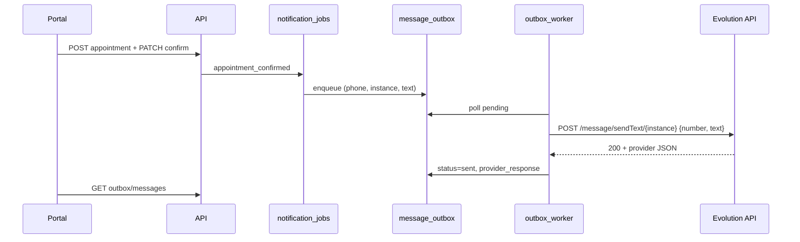

# Evidência 28 — Evolution E2E (Agenda → Outbox → Worker → WhatsApp)

**Branch:** `piloto-staging-01`  
**Script:** `scripts/piloto-evolution-e2e.ps1`  
**Log gerado:** `28_evolution_e2e_log.txt` (após execução local)

---

## Variáveis necessárias (sem segredos no Git)

| Variável | Exemplo documentado | Onde |
|----------|---------------------|------|
| `EVOLUTION_API_URL` | `http://host.docker.internal:8081` (API no Docker) | `.env` + `docker-compose.yml` (`api` e `n8n`) |
| `EVOLUTION_INSTANCE` | `<NOME_INSTANCIA>` (ex. instância QA local) | `.env` |
| `EVOLUTION_API_KEY` | `<API_KEY_EVOLUTION>` | `.env` apenas |
| `QA_WHATSAPP_NUMBER` | `5511973305448` (smoke n8n) | `.env` + serviço `n8n` |

Referência: `.env.example` (placeholders).

**Prioridade de instância:** `EVOLUTION_INSTANCE` no ambiente **sobrescreve** `tenant_integrations.config.instance_name` (seed demo usa `demo-qa-inbound`).

---

## Pré-requisitos operador

1. Evolution API ativa e instância com `connectionStatus=open`.
2. `docker compose up -d` — API, Postgres, Redis healthy.
3. Copiar `.env.example` → `.env` e preencher `EVOLUTION_*` (não commitar).
4. Alinhar telefone do cliente QA ao número de teste WhatsApp:
   ```sql
   -- executar localmente; usar número de teste do operador
   UPDATE customers SET phone = '<55DDDNUMERO>' WHERE id = '00000000-0000-4000-8000-000000004031';
   ```
5. Garantir URL acessível nos containers **api** e **n8n** (não usar `http://evolution.test` do CI):
   ```powershell
   docker compose -f docker-compose.yml -f docker-compose.evolution-local.yml up -d --force-recreate api n8n
   ```
6. Smoke n8n: importar workflow `03_QA_Barbearia_Evolution_SendText_Smoke`, executar manualmente — ver `docs/PILOTO_STAGING_01_N8N.md`.

---

## Fluxo validado



**Payload Evolution (v2.3.7):** `{ "number": "...", "text": "..." }` na raiz — **não** usar `textMessage.text`.

---

## Execução

```powershell
.\scripts\piloto-evolution-e2e.ps1 -ApiBase http://localhost:3000
```

Critérios no script:

- Mensagem outbox com `status=sent` e `provider_response` preenchido.
- `correlation_id` = id do agendamento.
- Retry atendente → **403**; retry admin/manager → **200**.

---

## Evidências complementares (captura manual)

| # | Artefato | Status |
|---|----------|--------|
| 1 | Print `.env.example` (sem valores reais) | Operador |
| 2 | Log API/worker `[outbox-worker]` | Log container `barbearia-api` |
| 3 | Portal — agendamento criado | PNG |
| 4 | Portal — fila outbox status | PNG |
| 5 | Retry admin / 403 atendente | Script + PNG |

---

## Riscos residuais

- Piloto **externo** ainda exige staging cloud + secret manager (não só local).
- Telefone/número de teste é responsabilidade do operador (não versionar).
- Seed demo com instância inbound `demo-qa-inbound` — outbound local depende de `EVOLUTION_INSTANCE`.
