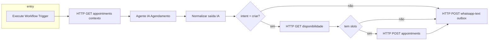

# Workflow 02 — `02_ai_scheduling_agent_multitenant` (análise técnica)

## Diagrama resumido

## Método oficial de disparo

1. Pelo workflow **01** (nó *Chamar Agente IA / Execute Workflow*), quando `route=agent` e `N8N_WORKFLOW_02_ID` apontar para o ID importado na instância n8n.  
2. Manualmente pela UI através de *Execute workflow*, passando como input o objeto que trigger do tipo *When Executed by Another Workflow* aceitar (estrutura alinhada à saída do nó *Registrar Core API* do fluxo 01 é o alvo habitual).

## Integração Core API

- Todas as URLs usam `$env.API_BASE_URL` (**obrigatório** `http://api:3000` no Compose).  
- Os nós `httpRequest` exigem **credencial Generic Header Auth**: `Authorization: Bearer …` **e** `x-tenant-id` coerentes com JWT do tenant (**nunca** aceitar tenant vindo apenas do texto do WhatsApp como fonte de verdade para gravação).

## Estado / lacunas da fábrica

| Tópico | Situação |
|--------|-----------|
| Importação estrutural | JSON válido, `active=false`, sem URLs `localhost:3000` embutidas. |
| Credenciais LangChain (`@n8n/n8n-nodes-langchain.agent`) | **Não** versionadas — após import é preciso configurar modelo (ex.: OpenAI) e ferramentas se aplicável. Grafo incompleto se faltar modelo. |
| Riscos tenant | Resolver tenant exclusivamente pela credencial Bearer + headers após onboarding operacional — documentado no próprio fluxo meta. |

## Payload de entrada (referência quando chamado pelo 01)

Objeto já enriquecido pelo Core deve incluir, no mínimo, caminhos esperados pela expressão `$('Normalizar saida IA')` e encadeamentos HTTP seguintes (`customer_id`, `intent`, datas, etc.). Ajustes finos dependem das credenciais e do prompt.

## Execução e erros esperados

A API já distingue 400 / 401 / 403 / 409 / 422 / 500 em rotas públicas/documentadas — o fluxo atual **delega tratamento granular** aos nós HTTP (falhar visível na execução + logs Fastify).

## Resultado esperado (happy-path teórico)

1. Availability retorna slots.  
2. POST `/api/v1/appointments` cria agendamento.  
3. POST `/integrations/outbound/whatsapp-text` **enfileira** resposta cliente via outbox (**não chama Evolution** directamente aqui).

## Evidências

Ficheiro `14_workflow_02_execution_output.json` — exemplo estrutural; evidência fotográfica/JSON real após primeira execução E2E com credenciais.

## Comprovações pendentes (horas estimadas QA)

Configurar credenciais Bearer + modelo LLM — **≈ 1–4 h** conforme conta OpenAI/disponibilidade.

## Aprovado pela fábrica nesta entrega?

**Não (condicional).** Razão: dependência de credenciais e LLM externos não validáveis apenas por JSON exportado sem execução com segredos reais na instância n8n do piloto.
