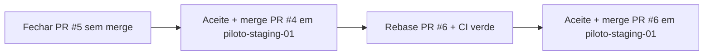

# Governança PO — PRs abertos (piloto staging)

**Data decisão PO:** 2026-05-17 · **Rebase validado PO:** 2026-05-17  
**Regra global:** **nenhum merge em `main`**. Merge **somente** em `piloto-staging-01` e **somente** após aceite formal do PO + **CI verde**.

**Canal único PILOTO-STAGING-04:** [PR #6](https://github.com/rvbbarreto-bot/barbearia-saas/pull/6) — não abrir novo PR.

---

## Estado atual (pós-rebase)

| Marco | SHA | Estado |
|-------|-----|--------|
| Tip `piloto-staging-01` (base comum) | `e6527e6` | Merge PR #4 concluído |
| HEAD remoto P04 | `782b530` | Branch atualizada sobre a base |
| Commits P04 à frente da base | **16** | Diff limpo pós-rebase |
| Governança sequência #5→#4→#6 | **APROVADA PO** | — |
| Merge PR #6 | **BLOQUEADO** | Até CI verde + aceite formal PO |

**Atenção operacional:** não clicar em *Compare & pull request* no banner amarelo do GitHub (evita PR duplicado).

---

## Ordem obrigatória de fecho

| Etapa | Status |
|-------|--------|
| A — Fechar #5 | **OK** |
| B — Merge #4 → `piloto-staging-01` | **OK** (`e6527e6`) |
| C — Rebase #6 + CI verde | **EM CURSO** — aguardar checks |
| D — Aceite PO + merge #6 | **PEND** |

---

## PR #5 — fechar sem merge

| Campo | Valor |
|-------|--------|
| **Estado** | **Concluído** (fechado sem merge) |
| **Ação PO** | **Fechar sem merge** |
| **Motivo** | Contra `main` e/ou duplicado do PR #4 |
| **Responsável** | Admin GitHub / GP |

**Checklist antes de fechar:**

1. Confirmar `base` = `main` **ou** diff redundante com PR #4.
2. **Close pull request** — não usar *Merge*.
3. Manter PR #4 como canal único PILOTO-STAGING-03.

---

## PR #4 — PILOTO-STAGING-03 (válido)

| Campo | Valor |
|-------|--------|
| **Estado** | **Merged** em `piloto-staging-01` (`e6527e6`) |
| **Título** | Feature/piloto staging 03 qa operacional n8n ready |
| **Head** | `feature/piloto-staging-03-qa-operacional-n8n-ready` (confirmar no GitHub) |
| **Base obrigatória** | `piloto-staging-01` |
| **Smoke SendText** | **Aprovado PO** (`d687684` + reimport n8n) — ver `12_evolution_qa_smoke_evidencia.md` |
| **Pré-merge** | Base = `piloto-staging-01` · CI verde · aceite formal PO |
| **Merge** | **Autorizado** em `piloto-staging-01` após aceite (nunca `main`) |

---

## PR #6 — PILOTO-STAGING-04 (canal único)

| Campo | Valor |
|-------|--------|
| **Título** | Feature/piloto staging 04 operacao assistida suite produto |
| **Head** | `feature/piloto-staging-04-operacao-assistida-suite-produto` @ `782b530` |
| **Base obrigatória** | `piloto-staging-01` @ `e6527e6` |
| **Rebase pós-#4** | **OK** — base comum = tip de `piloto-staging-01` |
| **Estado CI** | **PEND** — anexar URL run verde pós-`782b530` |
| **Aceite técnico fatia 1 + smoke** | Aprovado PO |
| **Governança** | **Aprovada PO** |
| **Merge** | **BLOQUEADO** até CI verde + aceite formal PO |

**Próximo passo obrigatório:**

1. Aguardar **CI verde** no PR #6 (push `782b530`).
2. Anexar evidência dos checks (screenshot ou URL Actions no PR).
3. Confirmar diff limpo vs `piloto-staging-01` (16 commits, sem conflitos).
4. Aceite formal PO → merge em `piloto-staging-01`.

---

## Proibições

- Merge ou PR target **`main`**
- Manter **#5** aberto após decisão PO
- Clicar **Compare & pull request** no banner amarelo (cria PR duplicado)
- Merge **#6** antes de **CI verde** ou sem aceite PO
- Dois PRs com o mesmo escopo piloto abertos em paralelo

---

## Referências

- `03_matriz_aceite.md` — secção A (governança)
- `10_relatorio_entrega_po.md` — secção 3 e 13
- `11_pr_piloto04.md` — checklist PR #6
- `12_evolution_qa_smoke_evidencia.md` — smoke aprovado (pré-requisito aceite #4)
