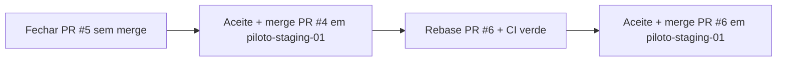

# Governança PO — PRs abertos (piloto staging)

**Data decisão PO:** 2026-05-17  
**Regra global:** **nenhum merge em `main`**. Merge **somente** em `piloto-staging-01` e **somente** após aceite formal do PO. Nenhum PR duplicado permanece aberto.

---

## Ordem obrigatória de fecho



---

## PR #5 — fechar sem merge

| Campo | Valor |
|-------|--------|
| **Ação PO** | **Fechar sem merge** |
| **Motivo** | Contra `main` e/ou duplicado do PR #4 |
| **Responsável** | Admin GitHub / GP |

**Checklist antes de fechar:**

1. Confirmar `base` = `main` **ou** diff redundante com PR #4.
2. **Close pull request** — não usar *Merge*.
3. Manter PR #4 como canal único PILOTO-STAGING-03.

---

## PR #4 — PILOTO-STAGING-03 (válido)

| Campo | Valor |
|-------|--------|
| **Título** | Feature/piloto staging 03 qa operacional n8n ready |
| **Head** | `feature/piloto-staging-03-qa-operacional-n8n-ready` (confirmar no GitHub) |
| **Base obrigatória** | `piloto-staging-01` |
| **Smoke SendText** | **Aprovado PO** (`d687684` + reimport n8n) — ver `12_evolution_qa_smoke_evidencia.md` |
| **Pré-merge** | Base = `piloto-staging-01` · CI verde · aceite formal PO |
| **Merge** | **Autorizado** em `piloto-staging-01` após aceite (nunca `main`) |

---

## PR #6 — PILOTO-STAGING-04 (aguarda PR #4)

| Campo | Valor |
|-------|--------|
| **Título** | Feature/piloto staging 04 operacao assistida suite produto |
| **Head** | `feature/piloto-staging-04-operacao-assistida-suite-produto` |
| **Base obrigatória** | `piloto-staging-01` |
| **Estado CI** | Verde (após `a25443e`) |
| **Aceite técnico fatia 1 + smoke** | Aprovado PO |
| **Merge** | **BLOQUEADO** até merge do PR #4 em `piloto-staging-01` |

**Após merge do PR #4:**

```bash
git fetch origin
git checkout feature/piloto-staging-04-operacao-assistida-suite-produto
git rebase origin/piloto-staging-01
# ou: git merge origin/piloto-staging-01
git push origin feature/piloto-staging-04-operacao-assistida-suite-produto
```

1. Revalidar diff do PR #6 (sem conflitos / sem regressão).
2. Aguardar **CI verde** no PR #6.
3. Aceite formal PO → merge em `piloto-staging-01`.

---

## Proibições

- Merge ou PR target **`main`**
- Manter **#5** aberto após decisão PO
- Merge **#6** antes do fecho correto de **#4**
- Dois PRs com o mesmo escopo piloto abertos em paralelo

---

## Referências

- `03_matriz_aceite.md` — secção A (governança)
- `10_relatorio_entrega_po.md` — secção 3 e 13
- `11_pr_piloto04.md` — checklist PR #6
- `12_evolution_qa_smoke_evidencia.md` — smoke aprovado (pré-requisito aceite #4)
